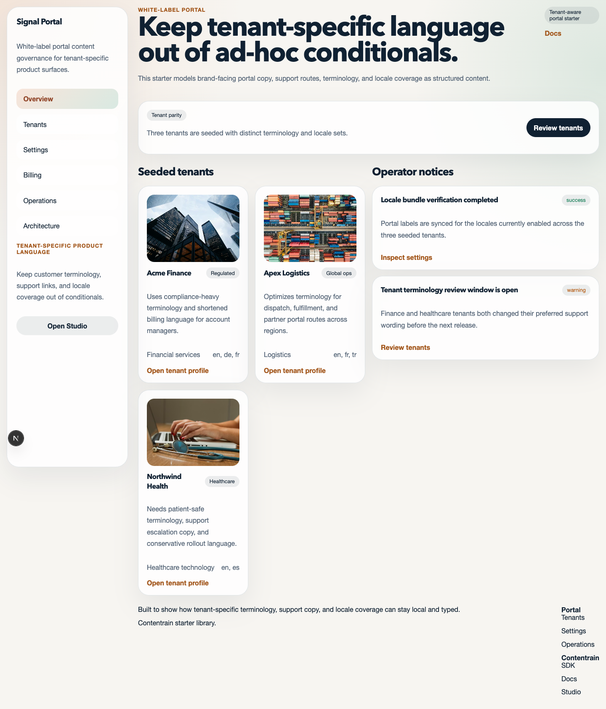
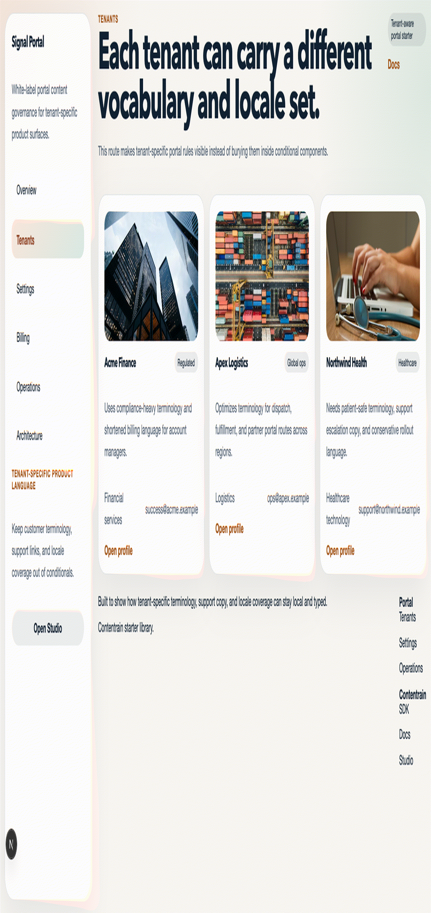

> Source of truth: this starter is exported from the `contentrain-starters` monorepo.
> Internal starter id: `next-white-label-portal`.
# Contentrain Next White-Label Portal

Next.js starter for products that need tenant-specific terminology, support language, locale coverage, and brand-aware portal content.





## Start

```bash
pnpm install
pnpm dev
```

## Commands

```bash
pnpm check
pnpm build
pnpm start
pnpm deploy:netlify
```

## Demo routes

- `/`
- `/tenants`
- `/tenants/acme-finance`
- `/settings`
- `/billing`
- `/operations`
- `/architecture`

## Why this starter exists

- White-label products rarely fail on layout; they fail on terminology drift and tenant-specific copy sprawl
- Tenant language, locale availability, and support links should be modeled content, not hidden in conditionals
- Contentrain keeps brand-facing portal language local, typed, and reviewable

Official references:

- [SDK](https://ai.contentrain.io/packages/sdk.html)
- [Docs](https://docs.contentrain.io/)
- [Studio](https://studio.contentrain.io/)

## Deploy

- Netlify build command: `pnpm deploy:netlify`
- Netlify publish directory: framework-managed
- Keep the publish directory empty in the Netlify UI and let the Next.js runtime be detected automatically

## Netlify Project Creation

[](https://app.netlify.com/start/deploy?repository=https%3A%2F%2Fgithub.com%2FContentrain%2Fcontentrain-starter-next-white-label-portal)

Use `pnpm dlx netlify-cli init` to connect the repository for continuous deployment, or `pnpm dlx netlify-cli link` if the site already exists.
